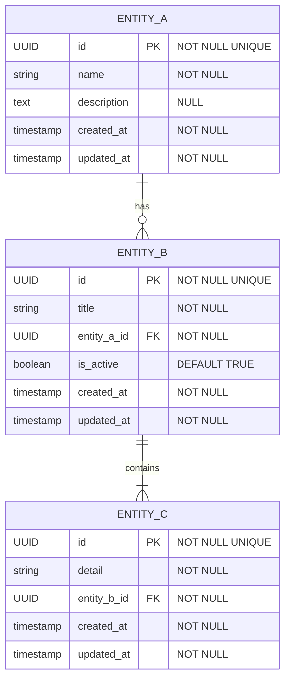

# ARCHITECTURE AND DEVELOPMENT PLAN TEMPLATE - [PROJECT NAME]

**[PROJECT TYPE / BRIEF DESCRIPTION]**
**Version:** 1.0
**Date:** [DATE]
**Tech Stack:** [MAIN TECH STACK]

---

## TABLE OF CONTENTS

1.  [Executive Summary and Architectural Decisions](#1-executive-summary-and-architectural-decisions)
2.  [Project Structure](#2-project-structure)
3.  [Complete Data Model](#3-complete-data-model)
4.  [Technical Implementation by Module](#4-technical-implementation-by-module)
5.  [Role-Based Access Control (RBAC) System](#5-role-based-access-control-rbac-system)
6.  [External Integrations](#6-external-integrations)
7.  [Development Phases and Roadmap](#7-development-phases-and-roadmap)
8.  [Security Considerations](#8-security-considerations)
9.  [Infrastructure and DevOps](#9-infrastructure-and-devops)
10. [Validation Checklist](#10-validation-checklist)
11. [Pending Decisions](#11-pending-decisions)

---

## 1. EXECUTIVE SUMMARY AND ARCHITECTURAL DECISIONS

### 1.1 Project Overview

**[PROJECT NAME]** is a [SYSTEM TYPE, e.g., SaaS, Mobile App, Web Platform] designed for [PROJECT'S MAIN GOAL]. The platform will offer:

- **[Key Feature A]:** [Description of Feature A].
- **[Key Feature B]:** [Description of Feature B].
- **[Key Feature C]:** [Description of Feature C].
- **[Key Feature D]:** [Description of Feature D].
- **[Key Feature E]:** [Description of Feature E].
- **[Key Feature F]:** [Description of Feature F].

### 1.2 Fundamental Architectural Decisions

#### A. Main Technology Stack

_[Detail the chosen tech stack here: language, framework, database, etc.]_

#### B. Architectural Decision Records (ADRs)

_Key architectural decisions for this project are documented as Architectural Decision Records (ADRs) in the `/docs/adr` directory. Refer to ADR-001, ADR-002, etc., for detailed context, decisions, and consequences._

---

## 3. COMPLETE DATA MODEL

### 3.1 Entity-Relationship Diagram

_[Replace the example above with your project's actual ER diagram. Use Markdown preview or GitHub to render.]_

### 3.2 Main Tables with Detailed Fields

#### 3.2.1 [Module Name 1, e.g., User Management] Module

- **table_1**: [Fields and description].
- **table_2**: [Fields and description].

#### 3.2.2 [Module Name 2, e.g., Content] Module

- **table_3**: [Fields and description].
- **table_4**: [Fields and description].

---

## 4. TECHNICAL IMPLEMENTATION BY MODULE (SUMMARY)

### 4.1 Administration Module

- **[Admin Feature A]:** [Brief description of technical implementation].
- **[Admin Feature B]:** [Brief description of technical implementation].

### 4.2 End User Module

- **[User Feature A]:** [Brief description of technical implementation].

- **[User Feature B]:** [Brief description of technical implementation].

#### 4.3 API Endpoints (Per Module)

_[Define key API endpoints for each module, specifying HTTP method, path, and expected parameters. This enables automated routing and basic API client generation.]_

- **[Module Name, e.g., User Module]**

  - `POST /api/[module-plural]` (Create Entity)

    - Request Body: `{ "field1": "type", "field2": "type" }`

    - Response: `201 Created`

  - `GET /api/[module-plural]/{id}` (Get Single Entity)

    - Response: `200 OK`, `{ "id": "uuid", ... }`

  - `PUT /api/[module-plural]/{id}` (Update Entity)

    - Request Body: `{ "field1": "new_value" }`

    - Response: `200 OK`

--- 

## 10. Validation Checklist

# Audit Checklists

## 1. General and Style Requirements

- [ ] Code in English throughout the project
- [ ] Comments in Spanish throughout the project
- [ ] No functionalities outside the original documentation/prompt have been implemented or added
- [ ] Code structure consistent with the defined personal style
- [ ] Variable, function and class names are consistent and readable

## 2. Documentation Comparison

- [ ] All described functionalities are implemented
- [ ] There are no extra undocumented or unjustified functionalities
- [ ] Acceptance criteria (if any) are met
- [ ] There are no contradictions between code and documentation
- [ ] Unclear points requiring review with the client / manager were recorded

## 3. Checklist Format Convention

The checklist must be organized in sections. Use the format:

- `[ ]` for pending or unfulfilled items
- `[x]` for fulfilled items
- `[?]` for items that require clarification

## 4. SEO Content Validation (for Deliverable #6: Backlink Publication)

### Mandatory compliance checklist

- [ ] **Minimum length**: 

- [ ] **Header structure**: H1, H2, H3 correctly ordered
- [ ] **Frequently asked questions**: 5 H3 in question format
- [ ] **Paragraph length**: All between 100-200 words
- [ ] **Main keyword**: Present in ALL paragraphs with `<strong>`
- [ ] **SEO title**: Defined with keyword
- [ ] **SEO description**: Defined (max 160 characters)
- [ ] **Slug**: Defined in URL-friendly format
- [ ] **ALT texts**: 5 descriptions for images
- [ ] **Final CTA**: Call to action present and effective

## 5. Risks, Doubts, and Future Work Template

Use this template structure in your final report:

### Detected Risks (by priority)

- **High**: {{critical_risk}}
- **Medium**: {{moderate_risk}}
- **Low**: {{minor_risk}}

### Doubts / Necessary Clarifications

- {{doubt_1}}
- {{doubt_2}}

### Suggested Future Work (without changing the code now)

- {{task_1}}
- {{task_2}}

11. [Pending Decisions](#11-pending-decisions)
--- 

## 11. PENDING DECISIONS (Awaiting Confirmation)
---

## 11. PENDING DECISIONS (Awaiting Confirmation)

To finalize the project scope, the following points need clarification:

1.  **[Topic A]:**

    - [Specific question 1 about Topic A].
    - [Specific question 2 about Topic A].

2.  **[Topic B]:**

    - [Specific question 1 about Topic B].

3.  **[Topic C]:**
    - [Specific question 1 about Topic C].
    - [Specific question 2 about Topic C].
